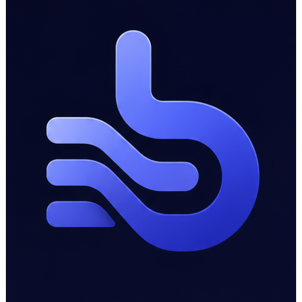

<div align="center">



# Ban

**A clean, project-local Kanban for developers.**
Each card is a Markdown file. Capture ideas globally, shape them into tasks, and keep every project's thinking next to its code.

[Features](#features) · [Philosophy](#philosophy) · [Getting started](#getting-started) · [Keyboard shortcuts](#keyboard-shortcuts) · [العربية](#نظرة-عامة-بالعربية)

</div>

---

## What is Ban?

Ban is **not** a generic task manager, a Trello/Linear clone, or a Notion database. It is a **local, file-based, agent-agnostic source-of-truth workspace for developers** — your repository becomes the single truth every AI agent reads from and writes to, so you can use any agent for any task without losing your tasks, plans, rules, or history to that agent's walled garden.

When you open a project folder, Ban sets it up with plain, visible, git-committed folders next to your code — no hidden database:

```
your-project/
├── Tasks/                          ← Kanban cards (one card = one Markdown file)
│   ├── inbox/   shape/   ready/
│   ├── doing/   review/  done/   killed/
│       └── fix-auth-redirect-bug__001.md
├── Plans/                          ← planning documents
├── Skills/                         ← reusable agent skills as Markdown
├── RULES.md                        ← canonical rules, the single source of truth
├── CLAUDE.md  AGENTS.md  …         ← each agent's native config, pointing back to RULES.md
└── .ban/                           ← Ban's own app data (config, tags, activity) — gitignored
```

Moving a card between columns moves its file between folders. Editing a card in VS Code — or having an agent edit it directly — updates the board live, and agent edits are recorded in the Journey as attributed events. The Markdown files are the source of truth, and they travel with your repo.

## Features

- 🗂️ **Project-local, visible boards** — `Tasks/` lives in your repo, committed with your code
- 📝 **Cards are Markdown files** — readable, editable, and git-friendly, with YAML frontmatter
- ✨ **Live Markdown editor** — Notion-style inline rendering, no edit/preview toggle, no raw symbols
- ⚡ **Global capture** — `Ctrl + Shift + Space` from anywhere on Windows to drop a thought into the inbox
- 🏷️ **Capture syntax** — `Some title @status #tag #tag` parses status and tags automatically
- 🔵 **Linear-style status icons** — progressive pie states (backlog → in-progress → done) with distinct colors
- 🎨 **Auto-colored tags** — every tag gets a stable, distinct color across the board
- 🌗 **4 themes** — Soft Dark, OLED Black, Clean White, Warm Paper
- 🌐 **English + Arabic UI** — full RTL mirroring; Arabic text set in Noto Naskh
- 🔍 **Instant search** — by title, body, tags, and status (`Ctrl + K`)
- 👀 **Disk sync** — a file watcher keeps the board in sync with external edits
- 🖱️ **Drag & drop** — move cards between columns

## Philosophy

The core flow is **capture first, classify later**:

1. Anything you capture lands in **Inbox** — every capture is just a thought.
2. It gets **shaped**: maybe it stays an idea, maybe it becomes a task that needs a plan.
3. It flows through the pipeline: `inbox → shape → ready → doing → review → done` (or `killed`).

The pipeline (the **columns/status**) is what matters day to day. Card *types* (idea, task, bug, …) are lightweight, optional metadata for scanning and filtering — never a required decision at capture time.

## Tech stack

- **Electron** — desktop shell, global shortcut, native file system
- **Next.js + React** — renderer UI
- **TipTap + tiptap-markdown** — the live Markdown editor
- **Tailwind CSS** — theming via CSS variables
- **Zustand** — state
- **better-sqlite3** — search index (the `.md` files remain the source of truth)
- **gray-matter** — frontmatter parsing
- **chokidar** — file watching
- **Hugeicons** — iconography

## Getting started

> Requires Node.js 18+ and Windows (global capture + window chrome are Windows-tuned; other platforms run but are untested).

```bash
# install
npm install

# run in development (Next.js + Electron with hot reload)
npm run dev

# build a production installer (Windows NSIS)
npm run dist
```

`npm run dev` starts the Next.js renderer, compiles the Electron main process, and launches the app.

## Keyboard shortcuts

| Action            | Shortcut               |
| ----------------- | ---------------------- |
| Quick Capture     | `Ctrl + Shift + Space` |
| Command Palette   | `Ctrl + K`             |
| New Card          | `N`                    |
| Save Card         | `Ctrl + S`             |

## Project structure

```
app/            Next.js routes (board, capture window, settings)
components/     React UI (board, card, layout, settings, providers)
lib/            stores (board/ui/settings), i18n, types, helpers
electron/       main process, IPC, file system, db, watcher
styles/         global CSS + themes
resources/      app icon
```

## Roadmap

Planned (from the product spec): internal card links `[[card-id]]` and backlinks, export/import, "open in external editor", clipboard capture, and a tag graph. Cloud sync and AI hand-off are explicitly out of MVP scope.

## Contributing

Issues and pull requests are welcome. This is an open-source project built for solo developers and AI-assisted coding workflows.

## License

[MIT](LICENSE) © 2026 Abdelrahman Hamada

---

## نظرة عامة بالعربية

**Ban** هو تطبيق **كانبان محلي لكل مشروع** للمطورين. كل بطاقة عبارة عن ملف Markdown، وكل مشروع له لوحته الخاصة داخل فولدر `.kanban/` بجانب الكود.

- **التقاط سريع** من أي مكان في ويندوز (`Ctrl + Shift + Space`) — أي حاجة تتلقط تروح للـ Inbox.
- **محرر Markdown حي** بعرض مباشر زي نوشن، من غير وضعين ولا رموز ظاهرة.
- **صيغة الالتقاط**: `عنوان البطاقة @الحالة #تاج` بتتفسر تلقائيًا.
- **أيقونات حالة على طريقة Linear** بألوان مميزة، و**تاجز بتتلون تلقائيًا**.
- **٤ سمات** (داكن هادئ، أسود أوليد، أبيض نقي، ورقي دافئ) و**واجهة عربي/إنجليزي** بدعم كامل لـ RTL وخط نوتو نسخ.
- **سحب وإفلات** للكروت بين الأعمدة، و**مزامنة** مع التعديلات الخارجية على الملفات.

الفكرة الأساسية: **التقط أولًا، صنّف لاحقًا** — أي شيء تلتقطه هو مجرد فكرة في البداية، ثم يتشكّل ويتحرك في المسار: `inbox → shape → ready → doing → review → done`.

للتشغيل: `npm install` ثم `npm run dev`.
